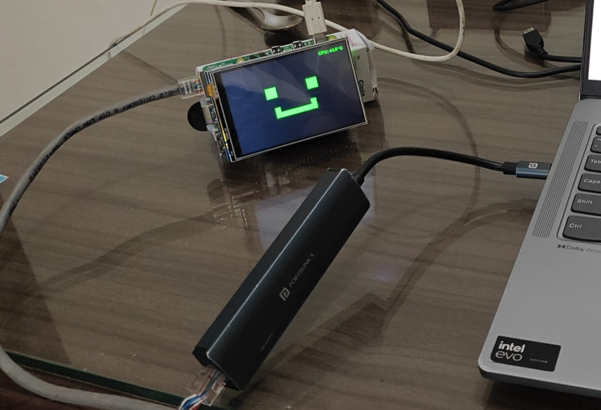
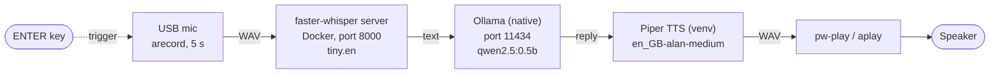
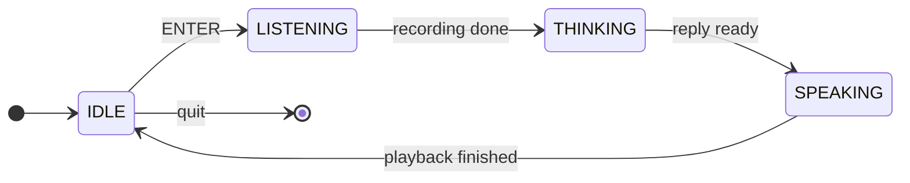

<p align="center">
  
</p>

<h1 align="center">Alan</h1>

<p align="center">
  <b>An offline voice assistant for the Raspberry Pi 5, with a pixel face on a 3.5" LCD.</b><br>
  You press ENTER and talk. Alan transcribes what you said, thinks about it and answers out loud.<br>
  Everything runs on the Pi, with no cloud APIs.
</p>

<p align="center">
  
  
  
  
  <a href="LICENSE"></a>
</p>

<p align="center"><sub>Alan idling on a Raspberry Pi 5: the square-eyed smile on the 3.5" SPI LCD, with the CPU temperature in the top-right corner.</sub></p>

---

## Contents

- [Features](#features)
- [How it works](#how-it-works)
- [Hardware](#hardware)
- [Software stack](#software-stack)
- [Quick start](#quick-start)
- [Detailed setup](#detailed-setup)
- [Configuration](#configuration)
- [Run on boot](#run-on-boot)
- [Face states](#face-states)
- [Troubleshooting](#troubleshooting)
- [Project structure](#project-structure)
- [Roadmap](#roadmap)
- [Contributing](#contributing)
- [License](#license)
- [Acknowledgements](#acknowledgements)

## Features

- **Fully offline voice pipeline.** Speech-to-text, the language model and text-to-speech all run locally once setup is done.
- **Animated pixel face.** A green face on a 480x320 LCD shows whether Alan is idle, listening, thinking or speaking.
- **CPU temperature readout.** The top-right corner of the screen shows the Pi's temperature.
- **One-shot install.** `./scripts/install.sh` sets up the system packages, Docker, Ollama, the Python venv, the Piper voice and the Whisper image.
- **One-command launch.** `./scripts/start.sh` brings up the services, waits until they are healthy, then starts Alan.
- **Autostart on boot.** An optional systemd service runs Alan on `tty1`, so you can use a USB keyboard plugged into the Pi.
- **Configurable.** Every setting lives in a single `config.env` file.

## How it works



1. **Trigger.** Press ENTER in the terminal. Typing `quit` and pressing ENTER exits.
2. **Listen.** `arecord` captures 5 seconds of mono audio from the USB microphone.
3. **Transcribe.** The WAV file goes to a [faster-whisper](https://github.com/SYSTRAN/faster-whisper) server in a Docker container, through its OpenAI-style `/v1/audio/transcriptions` route.
4. **Think.** The text goes to [Ollama](https://ollama.com) running natively on the Pi, along with a short system prompt that keeps the answers brief.
5. **Speak.** [Piper](https://github.com/rhasspy/piper) turns the reply into speech, and `pw-play` plays it. If `pw-play` isn't available, `aplay` is used instead.

The pipeline runs on a background thread. The pygame face runs on the main thread and redraws itself to match the current state:



## Hardware

| Part | Notes | Link |
| --- | --- | --- |
| Raspberry Pi 5 | 4 GB or 8 GB recommended | [raspberrypi.com](https://www.raspberrypi.com/products/raspberry-pi-5/) |
| USB 2.0 mini microphone | "Voice Recognition Portable Studio Speech Mic Audio Adapter for PC/Laptop". Any class-compliant USB mic should work. | &mdash; |
| 3.5" SPI touch-screen LCD | 480x320, ILI9486 display controller with XPT2046 touch. It sits on the GPIO header. | [robu.in](https://robu.in/product/3-5-touch-screen-lcd-raspberry-pi/) |
| microSD card | 32 GB or larger | &mdash; |
| Official 27 W USB-C power supply | The Pi 5 needs it for stable USB power | [raspberrypi.com](https://www.raspberrypi.com/products/27w-power-supply/) |
| Speaker | The Pi 5 has **no 3.5 mm jack**, so use USB, HDMI or Bluetooth audio | &mdash; |
| *Optional:* Active Cooler | Keeps the CPU temperature down during inference | [raspberrypi.com](https://www.raspberrypi.com/products/active-cooler/) |
| *Optional:* Ethernet cable | For a more reliable connection during install | &mdash; |
| *Optional:* USB keyboard | Needed to press ENTER when Alan runs as a service | &mdash; |

## Software stack

| Layer | Component | Where it runs |
| --- | --- | --- |
| OS | Raspberry Pi OS Bookworm (64-bit) | Host |
| Speech-to-text | faster-whisper server (`fedirz/faster-whisper-server:latest-cpu`), model `tiny.en` | Docker container `alan-whisper` |
| Language model | Ollama with `qwen2.5:0.5b` | Native systemd service `ollama` |
| Text-to-speech | Piper (`piper-tts==1.2.0`), voice `en_GB-alan-medium` | Python venv `.venv/` |
| Face / UI | pygame, drawing to the framebuffer | Python venv `.venv/` |
| Audio I/O | `arecord` (ALSA), `pw-play` (PipeWire) or `aplay` | Host |
| App | `alan` Python package, run with `python -m alan` | Python 3.11 venv |

## Quick start

You need a Pi running Raspberry Pi OS Bookworm 64-bit, with the mic and speaker connected. The LCD overlay must already be configured (see [Detailed setup](#detailed-setup)).

```bash
git clone https://github.com/Ayan2582/RPi-Ai-Assistant.git
cd RPi-Ai-Assistant

bash scripts/install.sh   # one-shot setup, safe to re-run (also makes the scripts executable)
sudo reboot            # applies the new group memberships (docker, audio, video)

cd RPi-Ai-Assistant
./scripts/start.sh     # starts Whisper, checks Ollama, launches Alan
```

When the face appears, press **ENTER**, speak for about 5 seconds, and Alan will answer. Type `quit` and press ENTER to exit.

To shut everything down:

```bash
./scripts/stop.sh        # stops Alan and the Whisper container
./scripts/stop.sh --all  # also stops Ollama
```

<details>
<summary><b>What <code>install.sh</code> does, and its flags</b></summary>

<br>

1. Installs the apt dependencies: Python venv and dev headers, `alsa-utils`, PipeWire tools, SDL2 libraries and `curl`.
2. Installs Docker if it's missing, and adds your user to the `docker`, `audio` and `video` groups.
3. Installs Ollama if it's missing, enables its service and pulls the model (`LLM_MODEL`).
4. Creates `.venv/` and installs `requirements.txt`.
5. Downloads the Piper voice (`.onnx` and `.onnx.json`) into `models/`.
6. Pulls the faster-whisper Docker image.
7. Creates `config.env` from `config.example.env`. An existing `config.env` is never overwritten.

| Flag | Effect |
| --- | --- |
| `--service` | Also installs and enables the `alan` systemd service (see [Run on boot](#run-on-boot)) |
| `--skip-docker` | Skips the Docker install |
| `--skip-ollama` | Skips the Ollama install and model pull |
| `-h` | Shows help |

</details>

<details>
<summary><b>What <code>start.sh</code> does</b></summary>

<br>

1. Loads `config.env`.
2. Starts the faster-whisper container with Docker Compose.
3. Makes sure the Ollama service is running.
4. Waits until both services pass their health checks, and prints a clear error if one doesn't come up in time.
5. Runs `python -m alan` from the repo's venv.

</details>

## Detailed setup

### 1. Flash the OS

Use [Raspberry Pi Imager](https://www.raspberrypi.com/software/) to flash **Raspberry Pi OS Bookworm (64-bit)**. Both Lite and Desktop work. Lite leaves more RAM for the models. In the Imager settings, turn on SSH and set your user name and Wi-Fi.

### 2. Connect the 3.5" LCD

Seat the LCD on the GPIO header with the Pi powered off.

> [!WARNING]
> Don't use the vendor's old **"LCD-show"** scripts. They were written for legacy Raspberry Pi OS and can break a Pi 5 running Bookworm, for example by replacing the boot config or the display stack.

Instead, enable SPI and add a device-tree overlay in `/boot/firmware/config.txt`:

```ini
dtparam=spi=on
dtoverlay=piscreen,speed=16000000,rotate=90
```

Some boards of this type work with `waveshare35a` instead of `piscreen`:

```ini
dtoverlay=waveshare35a
```

> [!NOTE]
> This is guidance, not a guarantee. The right overlay can vary between panel revisions. If the screen stays white or shows garbage, try the other overlay or change `rotate`.

Reboot, then find the framebuffer the LCD was given:

```bash
ls /dev/fb*
```

The LCD may be `/dev/fb0` or `/dev/fb1`, depending on whether HDMI also has a framebuffer. Set `SDL_FBDEV` in `config.env` to match. If pygame still can't open the display, also set `SDL_VIDEODRIVER=kmsdrm`.

### 3. Check the microphone

```bash
arecord -l   # find the USB card number
arecord -D hw:2,0 -c 1 -r 44100 -f S16_LE -d 5 test.wav && aplay test.wav
```

Replace `hw:2,0` with your card and device numbers. You normally don't need to set anything: the default `AUDIO_INPUT=auto` picks the first capture card whose name contains "USB". Set `AUDIO_INPUT` explicitly only if detection picks the wrong device.

### 4. Check the speaker

The Pi 5 has no headphone jack, so connect a USB, HDMI or Bluetooth speaker. Then test it:

```bash
speaker-test -c 2 -t wav -l 1
```

If you hear the test in the mic step above but nothing from Alan later, see [No audio under systemd](#troubleshooting).

## Configuration

All settings live in `config.env` in the repo root. `install.sh` creates it from `config.example.env`, and git ignores it. The format is one `KEY=VALUE` per line, with `#` comments and double quotes around values that contain spaces. Variables that are already set in the environment take priority.

| Variable | Default | Description |
| --- | --- | --- |
| `AUDIO_INPUT` | `auto` | ALSA capture device. `auto` picks the first `arecord -l` card with "USB" in its name, and falls back to `hw:2,0`. |
| `RECORD_SECONDS` | `5` | Recording length in seconds |
| `SAMPLE_RATE` | `44100` | `arecord` sample rate (mono, S16_LE) |
| `AUDIO_PLAYER` | `auto` | `auto` uses `pw-play` if it's installed, otherwise `aplay`. Can also be set to `pw-play` or `aplay`. |
| `WHISPER_URL` | `http://localhost:8000/v1/audio/transcriptions` | Speech-to-text endpoint |
| `WHISPER_MODEL` | `tiny.en` | Model name sent to Whisper |
| `WHISPER_IMAGE` | `fedirz/faster-whisper-server:latest-cpu` | Docker image used by the compose file |
| `OLLAMA_URL` | `http://localhost:11434` | Ollama base URL |
| `LLM_MODEL` | `qwen2.5:0.5b` | Ollama model |
| `SYSTEM_PROMPT` | `"You are Alan, a helpful, concise AI assistant. Keep answers under 2 sentences."` | System prompt sent with every request |
| `PIPER_VOICE` | `en_GB-alan-medium` | Voice file name under `models/`, without the extension |
| `SCREEN_WIDTH` | `480` | Display width in pixels |
| `SCREEN_HEIGHT` | `320` | Display height in pixels |
| `SDL_FBDEV` | `/dev/fb0` | Framebuffer device of the LCD |
| `SDL_VIDEODRIVER` | *(empty)* | SDL video driver, for example `kmsdrm` or `fbcon`. It's only applied when set. |
| `FPS` | `30` | Face frame rate |
| `SHOW_CPU_TEMP` | `1` | `1` shows `CPU: xx.x°C` in the top-right corner |
| `LOG_LEVEL` | `INFO` | Python logging level |

> [!TIP]
> To try a bigger model, pull it with `ollama pull <model>` and set `LLM_MODEL`. Keep an eye on RAM and the CPU temperature readout.

## Run on boot

Install and enable the systemd service:

```bash
./scripts/install.sh --service
```

Manage it with:

```bash
sudo systemctl start alan
sudo systemctl stop alan
sudo systemctl status alan
journalctl -u alan -f      # follow the logs
```

While the service runs, Alan takes over **`tty1`** in place of the normal login prompt. It reads ENTER from a **USB keyboard plugged into the Pi**, and its logs go to the journal. Stop the service before you run `./scripts/start.sh` by hand, because both would try to use the LCD and the mic at the same time.

## Face states

| State | Face | When |
| --- | --- | --- |
| `IDLE` | Square eyes and a smile | Waiting for ENTER |
| `LISTENING` | One eye closes and the mouth forms an "o" | Recording from the mic |
| `THINKING` | The eyes blink and the mouth is flat | Transcribing and waiting for the LLM |
| `SPEAKING` | The mouth opens and closes | Playing back the reply |

In every state, the CPU temperature (`CPU: xx.x°C`) is shown in the top-right corner. Set `SHOW_CPU_TEMP=0` to hide it.

## Troubleshooting

<details>
<summary><b>The face doesn't appear, or pygame can't open the display</b></summary>

<br>

- Run `ls /dev/fb*` and make sure `SDL_FBDEV` points at the LCD (`/dev/fb0` or `/dev/fb1`).
- Make sure your user is in the `video` group (`groups`). `install.sh` adds it, but the change only takes effect after you log out and back in, or reboot.
- Try `SDL_VIDEODRIVER=kmsdrm` in `config.env`.
- If `/dev/fb*` has no LCD at all, the overlay isn't loaded. Check `/boot/firmware/config.txt` (see [Connect the 3.5" LCD](#2-connect-the-35-lcd)).

</details>

<details>
<summary><b>Alan records silence, or the wrong microphone</b></summary>

<br>

- Run `arecord -l` and check that the USB mic is listed.
- Test it directly with `arecord -D hw:X,0 -c 1 -r 44100 -f S16_LE -d 5 test.wav && aplay test.wav`.
- If `AUDIO_INPUT=auto` picks the wrong card, set it explicitly, for example `AUDIO_INPUT=hw:3,0`.
- Check the capture level in `alsamixer` (press F6 to pick the USB card).

</details>

<details>
<summary><b>Whisper isn't ready, or transcription is empty</b></summary>

<br>

- Check the container with `docker ps` and `docker logs alan-whisper`.
- Check its health with `curl http://localhost:8000/health`.
- The first transcription can be slow while the model weights load into the `hf-cache` volume.
- If you get `permission denied` from Docker, your user isn't in the `docker` group yet. Reboot after `install.sh`.

</details>

<details>
<summary><b>Ollama errors, or the model is missing</b></summary>

<br>

- Check the service with `systemctl status ollama`.
- Check which models are installed with `ollama list`. If `qwen2.5:0.5b` (or your `LLM_MODEL`) isn't there, run `ollama pull qwen2.5:0.5b`.
- Check the API with `curl http://localhost:11434/api/tags`.

</details>

<details>
<summary><b>No audio when running under systemd</b></summary>

<br>

- `pw-play` needs your user's PipeWire session. `install.sh --service` enables lingering for your user so that session exists at boot. Check it with `loginctl show-user $USER | grep Linger`.
- Set `AUDIO_PLAYER=aplay` to skip PipeWire and play straight through ALSA.
- Check the logs with `journalctl -u alan -f`.

</details>

<details>
<summary><b>Pressing ENTER does nothing under systemd</b></summary>

<br>

- The service reads input from `tty1`, not from your SSH session. Press ENTER on a USB keyboard plugged into the Pi.
- To drive Alan over SSH, stop the service (`sudo systemctl stop alan`) and run `./scripts/start.sh` instead.

</details>

<details>
<summary><b>Piper fails or there's no voice file</b></summary>

<br>

- Check that `models/en_GB-alan-medium.onnx` and `models/en_GB-alan-medium.onnx.json` exist. If they don't, re-run `./scripts/install.sh`, which is safe to repeat.
- If you changed `PIPER_VOICE`, put the matching `.onnx` and `.onnx.json` files in `models/`.

</details>

## Project structure

```
RPi-Ai-Assistant/
├── README.md
├── LICENSE                    # Apache-2.0
├── .gitignore
├── requirements.txt           # requests, pygame, piper-tts (pinned)
├── config.example.env         # all settings (copied to config.env)
├── docker-compose.yml         # faster-whisper server
├── alan/
│   ├── __init__.py
│   ├── __main__.py            # entry point: python -m alan
│   ├── config.py              # settings from env / config.env
│   ├── state.py               # thread-safe state + shutdown event
│   ├── audio.py               # arecord / pw-play / aplay, USB mic detection
│   ├── stt.py                 # Whisper client
│   ├── llm.py                 # Ollama client
│   ├── tts.py                 # Piper wrapper
│   ├── pipeline.py            # ENTER → LISTENING → THINKING → SPEAKING → IDLE
│   └── face.py                # pygame face + CPU temperature
├── scripts/
│   ├── install.sh             # one-shot setup
│   ├── start.sh               # launcher
│   ├── stop.sh                # stop Alan + Whisper (--all: Ollama too)
│   └── alan.service           # systemd unit template
├── models/
│   └── .gitkeep               # Piper voice files are downloaded here
└── docs/images/alan-setup.png
```

## Roadmap

- [ ] **Touch-to-talk:** use the LCD's XPT2046 touch panel as the trigger
- [ ] **Wake word:** hands-free activation
- [ ] **Conversation memory:** keep context across turns
- [ ] **Voice activity detection:** stop recording when you stop talking, instead of after a fixed 5 seconds

## Contributing

Issues and pull requests are welcome.

1. Fork the repo and create a branch (`git checkout -b feature/my-idea`).
2. Keep new settings in `config.example.env`, with defaults that keep the current behaviour.
3. Run the basic checks before you open a PR:
   ```bash
   python -m py_compile alan/*.py
   bash -n scripts/*.sh
   ```
4. If you can, test on a real Pi 5, and describe your hardware (LCD model, mic, speaker) in the PR.

## License

Released under the [Apache License 2.0](LICENSE).

## Acknowledgements

- [Ollama](https://ollama.com) for local LLM serving
- [faster-whisper](https://github.com/SYSTRAN/faster-whisper) and [faster-whisper-server](https://github.com/fedirz/faster-whisper-server) for speech-to-text
- [Piper](https://github.com/rhasspy/piper) for the text-to-speech engine and the `en_GB-alan-medium` voice
- [pygame](https://www.pygame.org) for the face
